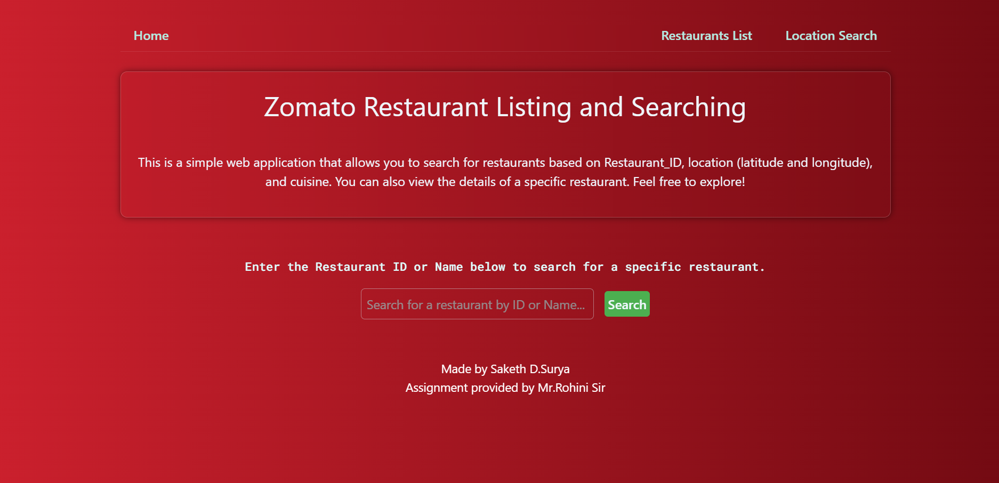
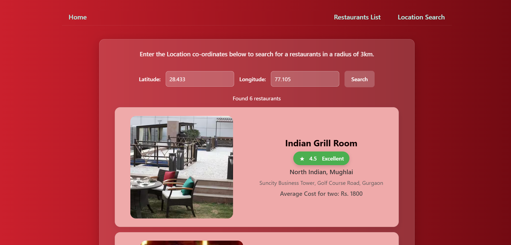
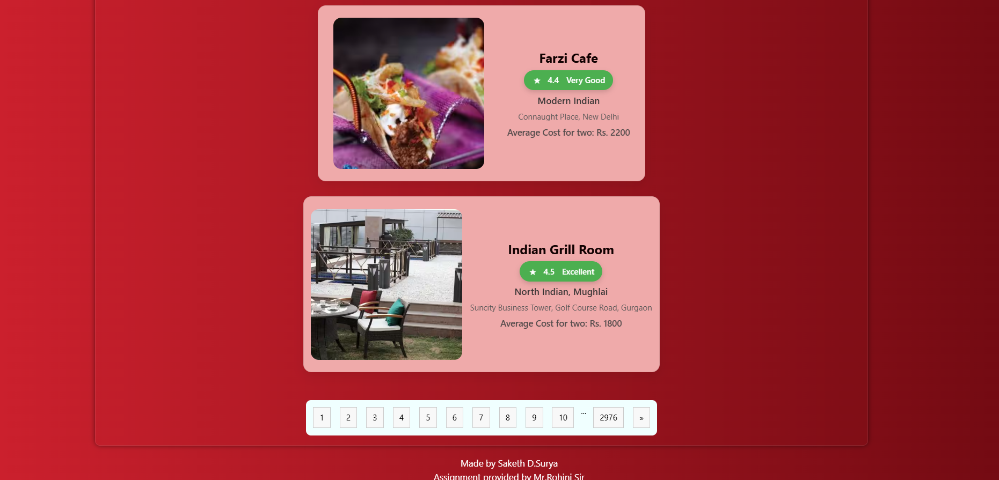
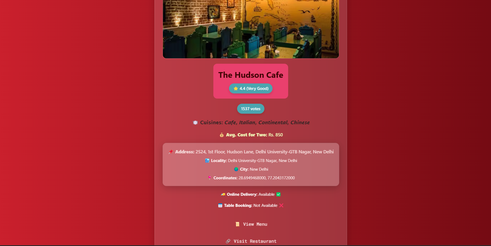

# Zomato Restaurants

Zomato restaurants is a web application built with **Vite** and **React** that aims to deliver a unique experience in exploring restaurants. This project is designed with a modern front-end stack to ensure high performance and a sleek user interface.

## Live Demo

Check out the live demo here: [Zomato Restaurants](https://zomato-pirates.onrender.com/)

## Table of Contents

- [Overview](#overview)
- [Features](#features)
- [Tech Stack](#tech-stack)
- [Preview](#Preview)
- [Installation](#installation)

## Overview

This project is inspired by the concept of restaurant discovery and review platforms. It leverages the speed of Vite and the flexibility of React to provide a responsive and interactive user experience. Also the backend is developed using FastAPI which provides quick api responses. 

## Features

- **Modern UI:** A clean and modern design built with React components.
- **Fast Performance:** Powered by FastAPI for a rapid Backend development environment.
- **Live Demo:** Easily accessible deployment for testing and demonstration.
- Users can search for restaurants using **restaurant name, id, location(latitude,longitude)**
- Also Users can see the list of all available restaurants

## Tech Stack

- **Frontend:** React, Vite
- **Backend:** FastAPI
- **Database:** Mongodb Atlas
- **Deployment:** Render

## Preview










## Installation

To run this project locally, follow these steps:

1. **Clone the repository:**

   ```bash
   git clone https://github.com/your-username/zomato-restaurants.git

   cd zomato-restaurants
   ```

2. **Install the dependencies:**
  - Frontend 
    
    - From root folder
    ```bash
    cd frontend/zomato-restaurants

    npm install

    npm run dev
    ```
    - Access the UI at - http://localhost:5173

  - Backend

    - From root folder
    ```bash
    cd backend

    pip install -r ../requirements.txt

    uvicorn server:app --host {give ip address(example: 0.0.0.0)} --port 8080 --reload
    ```
    - Access the backend at - http://{your specified host}:8080